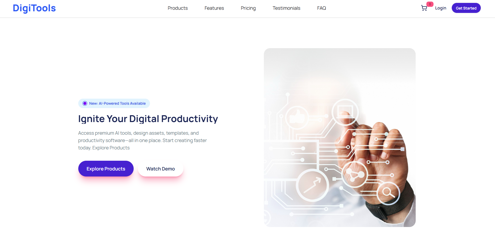
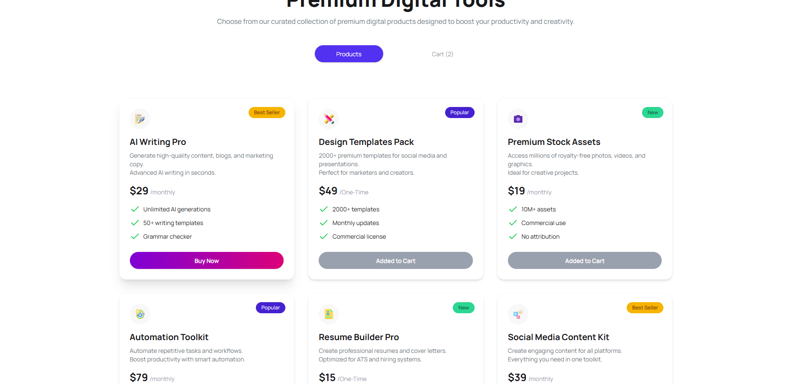
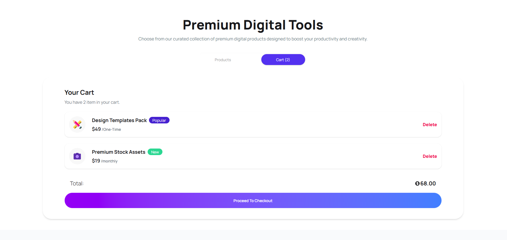

### 🌐 Live Site: [Visit Now 🚀](https://digitools-subs.netlify.app/) 

# 🚀 AI Subscription Marketplace

A modern and responsive web application where users can explore AI tools, view pricing plans, and manage subscriptions through a dynamic cart system. The app provides a smooth user experience with real-time cart updates, toast notifications, and clean UI components.

## 🧾 Description

This project is a fully functional frontend marketplace for AI-based tools and subscriptions. Users can browse products, add them to the cart (only once per item), view total pricing, and simulate a checkout process. It demonstrates strong React fundamentals, state management, and component-based architecture.

## 🛠️ Technologies Used

* ⚛️ **React** (with Suspense & Hooks)
* 🎨 **Tailwind CSS + DaisyUI**
* 🔔 **React Toastify** (for notifications)
* 🎯 **Lucide React Icons & React Icons**
* 📦 **JSON-based** data handling

## ✨ Key Features

1.  **🛒 Smart Cart System**
    * Add products only once (no duplicates)
    * Real-time cart count update
    * Dynamic total price calculation
2.  **🔄 Tab-Based Navigation**
    * Switch between Products and Cart seamlessly
    * Cart item count shown in tab label
3.  **🔔 Interactive User Feedback**
    * Toast notifications for add, delete, and checkout actions
    * Disabled button state for already added items
    * Clean and responsive UI with hover effects

## 📸 UI Highlights

* Beautiful product cards with badges (Popular, New, Best Seller)
* Gradient buttons and smooth transitions
* Empty cart illustration with user-friendly messaging
](image.png)

